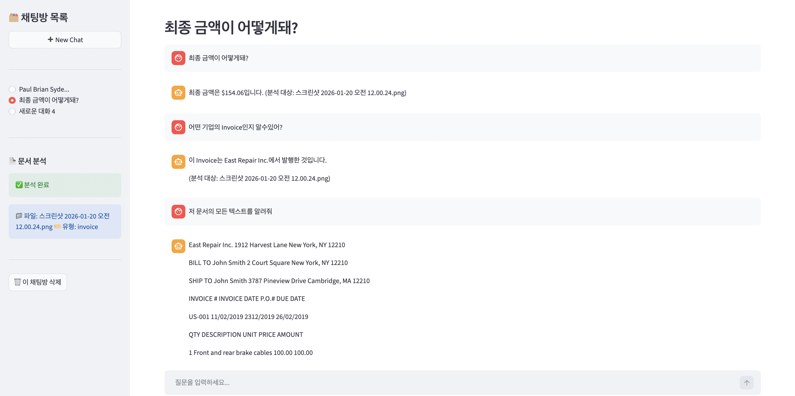
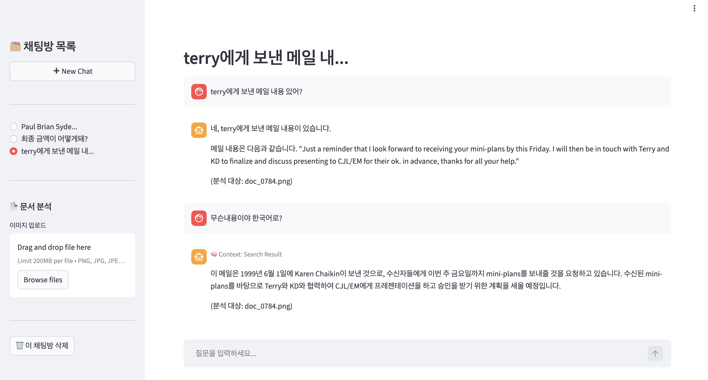
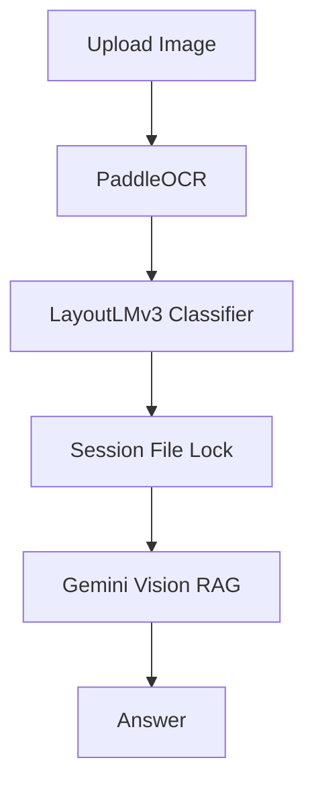

# 📂 Multimodal RAG Project

> **문서 이미지(Document Image)와 텍스트 정보를 통합 이해하여 Retrieval-Augmented Generation(RAG) 기반 질의응답을 수행하는 멀티모달 시스템**

본 프로젝트는 다음 단계로 구성된 **End-to-End Multimodal RAG 파이프라인** 구축을 목표로 합니다.

- 문서 이미지 수집
- OCR 기반 전처리
- LayoutLMv3 기반 문서 이해
- Gemini Text Embedding 기반 의미 검색
- Gemini Vision 기반 멀티모달 답변 생성


## 📸 System Demo & Screenshots

### 1. Invoice Document Analysis



- 사용자가 직접 Invoice 문서를 업로드
- OCR 기반 텍스트 추출 및 구조 분석 수행
- 금액, 기업 정보 등 핵심 내용에 대한 질의응답 지원
- Vision RAG 파이프라인을 통한 정확한 답변 생성


### 2. Email Document Understanding



- 스캔된 이메일 문서에 대한 OCR 처리
- 문서 내용 요약 및 핵심 정보 추출
- 멀티턴 대화 형식으로 추가 질문 가능


## Project Status

- [x] **Phase 1: 인프라 구축 및 데이터 파이프라인**
- [x] **Phase 2: 멀티모달 모델 학습 및 임베딩**
- [x] **Phase 3: RAG 시스템 구현 및 컨테이너화**
- [x] **Phase 4: 클라우드 배포**


## 📊 Dataset

### Dataset Overview
- **Source**: HuggingFace rvl_cdip (Streaming 방식 수집)
- **Scale**: 1,000 Images, 16 Classes (Balanced Subset)
- **Format**
  - Raw: `.png`
  - Processed: `.json` (Text + Bounding Box)

### Dataset Samples


### Data Management
- 통합 metadata.json 관리
- 손상 이미지 검증(Corrupt Image Check) 완료
- Parquet 기반 RAG용 임베딩 저장 완료


## Tech Stack

| Category              | Technology                      |
| --------------------- | ------------------------------- |
| **OCR & Vision**          | PaddleOCR, LayoutLMv3 (HuggingFace)|
| **Embedding & Retrieval** | Gemini Text Embedding, ChromaDB |
| **API & Backend**         | FastAPI, Pydantic, Docker       |
| **frontend**              | Streamlit                       |
| **Visualization**         | t-SNE (scikit-learn)            |
| **Storage**               | Parquet, AWS S3                 |
| **Infra**                 | Docker Compose, EC2             |


## 🔎 Phase 2: 멀티모달 문서 임베딩

### LayoutLMv3 기반 문서 이해
- **Input**
  - Image
  - OCR Text
  - Bounding Box Layout 정보
- **Model**
  - LayoutLMv3 Encoder
- **성능**
  - Validation Accuracy 85% 이상 달성
  - 클래스별 균형 잡힌 성능 분포 확인
  - t-SNE 시각화를 통해 임베딩 공간의 분리도 검증

### 임베딩 방식
- Encoder 출력에서 Masked Mean Pooling 적용
- 768-dim Document Embedding 생성
- t-SNE 분석을 통해 클래스별 군집 분리 확인

### 결과
- 시각 정보 + 텍스트 정보 결합 학습 성공
- 문서 유형별 의미적 군집 형성 확인


## 💡 Phase 3: 검색 파이프라인 재설계

### 🚨 초기 문제점

LayoutLM 기반 임베딩은 이미지와 텍스트가 결합된 **멀티모달 벡터**이기 때문에  
**텍스트로만 구성**된 사용자 질의와 동일한 임베딩 공간을 공유할 수 없었음.

→ 검색 성능 저하 문제 발생
→ LayoutLM은 **문서 이해에는 강력하지만, 검색용 임베딩 모델로는 부적합**


### ✅ 해결 방법: Gemini Embedding 도입

**개선 전략**

검색 대상 문서와 사용자 질의를  
동일한 텍스트 임베딩 공간으로 통일

```
이미지 → OCR → 텍스트 → Gemini Embedding
질문   → Gemini Embedding
```

**효과**

- Semantic Search 정확도 대폭 향상
- 실제 QA 성능 안정화


## 🏗️ Multimodal RAG 핵심 구성 요소

### 주요 컴포넌트

**1. Intent Router**
- Gemini Embedding 기반 Zero-shot 분류
- 질문 의도 및 카테고리 자동 예측
- 신뢰도가 낮을 경우 전체 검색(Fallback) 수행

**2. Retriever**
- Chroma Vector DB 기반 검색

**3. LLM Reranker**
- Top-k 결과 재정렬
- 가장 적합한 문서 선택

**4. Vision RAG**
- 이미지 + OCR JSON 결합 처리
- 표, 도장, 레이아웃 정보 반영

**5. Session & File Locking**
- 대화 상태 관리
- Multi-turn QA 지원


## ☁️ Phase 4: 확장 및 배포 

> **Note:** http://15.165.37.247:8501 -> 비용 상의 문제로 실행 중단 상태입니다.
> 필요 시 로컬 환경 또는 EC2에서 직접 실행 가능합니다.

### 1. Real-time Upload & QA Pipeline

사용자가 직접 문서를 업로드하여 즉시 QA를 수행할 수 있도록 파이프라인을 확장



### 2. AWS Cloud Infrastructure

**구성**
- Compute: AWS EC2
- Storage: AWS S3
- Backend: FastAPI
- Frontend: Streamlit

**네트워크 구조**

| Service   | Port |
|-----------|------|
| FastAPI   | 8000 |
| Streamlit | 8501 |
| SSH       | 22   |

---
### 3. Frontend (Streamlit UI)

CLI 기반 시스템을  
사용자 친화적인 웹 인터페이스로 확장

**제공 기능**
- 채팅 기반 QA 인터페이스
- 문서 업로드 패널
- 대화 히스토리 관리
- 다중 세션 지원

---
### 4. AWS S3 Storage Integration

**설계 목적**
- 로컬 파일 의존성 제거
- 안정적인 문서 관리

**흐름**
- 사용자 업로드 → S3 저장
- S3 문서 → OCR 전처리
- 처리 결과 → RAG 입력

**특징**
- 영구 데이터 보관
- 서버 장애와 무관한 안정성
- IAM 기반 보안 접근

---
### 5. Docker Orchestration

**목적**
- 환경 독립성 확보
- 재현 가능한 배포 구조

**구성**
- Backend / Frontend 분리 컨테이너
- Volume 기반 DB 유지
- 환경 변수 기반 설정

---

### 전체 파이프라인 흐름

User → UI → FastAPI → OCR → Router →  Vector DB → Reranker → LLM → Answer  

## 📌 Key Achievements

- 멀티모달 문서 이해 기반 RAG 시스템 완성
- OCR + Vision + LLM 통합 파이프라인 구축
- Gemini Embedding 기반 안정적인 검색 구조 설계
- Docker 기반 재현 가능한 배포 환경 구성
- AWS 기반 실제 서비스 운영 인프라 구축
- 사용자 친화적 Streamlit 인터페이스 제공
