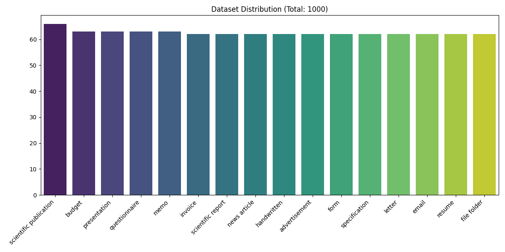
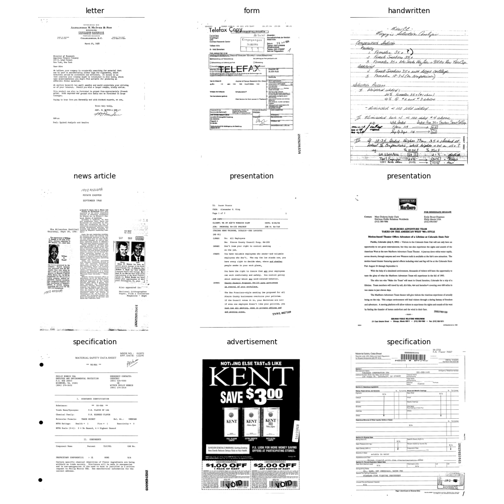

# 📂 Multimodal RAG Project

문서 이미지(Document Image)와 텍스트 정보를 함께 이해하여  
**Retrieval-Augmented Generation(RAG)** 시스템을 구축하는 멀티모달 프로젝트입니다.

본 프로젝트는  
**문서 이미지 수집 → 전처리 → 문서 이해 모델 → 검색 → 생성**으로 이어지는  
End-to-End 파이프라인 구축을 목표로 합니다.

현재는 **인프라 구축 및 데이터 파이프라인 단계**가 진행 중이며,  
모델 학습을 위한 데이터셋 구축과 검증을 완료한 상태입니다.

---

## Project Status

- [~] **Phase 1: 인프라 구축 및 데이터 파이프라인**
  - 데이터 수집 및 검증 완료
  - OCR 전처리 및 마이크로서비스 구현 예정
- [ ] Phase 2: 멀티모달 모델 학습 및 임베딩
- [ ] Phase 3: RAG 시스템 구현 및 컨테이너화
- [ ] Phase 4: 클라우드 배포 및 문서화

---

## 📊 Dataset

HuggingFace의 `rvl_cdip` 데이터셋을 **Streaming 방식**으로 수집하여  
문서 이미지 분류 및 멀티모달 학습에 활용 가능한 Subset을 구축했습니다.

- **Total Images:** 1,000
- **Classes:** 16  
  (Scientific publication, Budget, Invoice, Resume 등)
- **Dataset Processing**
  - 클래스 균형을 고려한 Subset 구성
  - 깨진 이미지(Corrupt Image) 전수 검사 완료
  - 학습 및 서빙 공용 메타데이터 생성 (`data/metadata.json`)

### Dataset Distribution

### Dataset Samples

---

## Tech Stack

- **Language:** Python 3.10+
- **Data Source:** HuggingFace Datasets
- **Backend**
  - FastAPI
  - Uvicorn
- **Libraries**
  - `datasets` (Streaming Download)
  - `Pillow` (Image Processing)
  - `Matplotlib` (EDA & Visualization)

---

##  Next Step

- OCR 엔진 연동을 통한 문서 이미지 텍스트 추출
- OCR 결과의 구조화(JSON) 및 API 제공
- 멀티모달 문서 이해 모델 학습을 위한 입력 파이프라인 완성

