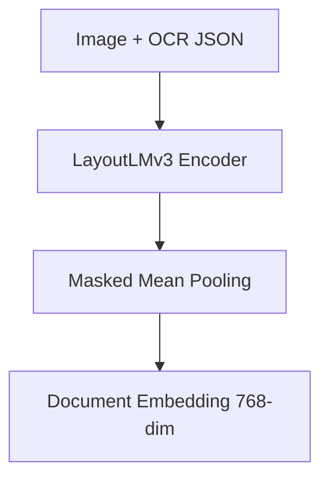
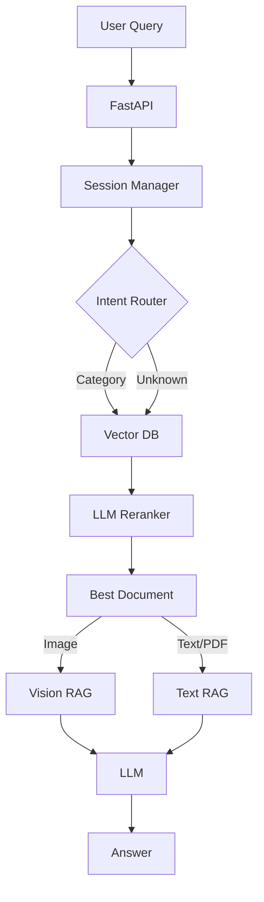

# 📂 Multimodal RAG Project

문서 이미지(Document Image)와 텍스트 정보를 함께 이해하여  
**Retrieval-Augmented Generation(RAG)** 시스템을 구축하는 멀티모달 프로젝트입니다.

본 프로젝트는  
**문서 이미지 수집 → 전처리 → 문서 이해 모델(LayoutLMv3) → 의미 검색(Gemini Text Embedding) → 멀티모달 생성(Gemini)**으로 이어지는  
End-to-End 파이프라인 구축을 목표로 합니다.

단순 텍스트 검색을 넘어, **레이아웃(Layout)과 시각적 정보(Visual Features)**를 함께 활용하여 **LLM 기반의 의도 분류(Intent Routing)**를 통해 검색 정확도를 극대화했습니다.

---

## Project Status

- [x] **Phase 1: 인프라 구축 및 데이터 파이프라인**
- [x] **Phase 2: 멀티모달 모델 학습 및 임베딩**
- [x] **Phase 3: RAG 시스템 구현 및 컨테이너화**
- [ ] **Phase 4: 클라우드 배포 및 문서화**

---

## 📊 Dataset

HuggingFace의 `rvl_cdip` 데이터셋을 **Streaming 방식**으로 수집하여  
문서 이미지 분류 및 멀티모달 학습에 활용 가능한 Subset을 구축했습니다.

- **Total Images:** 1,000
- **Classes:** 16  
  (Scientific publication, Budget, Invoice, Resume 등)
- **Dataset Processing**
  - 클래스 균형을 고려한 Subset 구성
  - 깨진 이미지(Corrupt Image) 전수 검사 완료
  - 학습 및 서빙 공용 메타데이터 생성 (`data/metadata.json`)
- **Format:**
  - Raw: `.png`
  - Processed: `.json` (Metadata + Full Text + BBox Info)

### Dataset Distribution


### Dataset Samples


---

## Tech Stack

| Category | Technology |
| --- | --- |
| **Language** | Python 3.10+ |
| **Visualization** | t-SNE (scikit-learn) |
| **OCR Engine** | PaddlePaddle, PaddleOCR |
| **Data Processing** | Pydantic (Schema), Pillow, NumPy |
| **Model** | LayoutLMv3 (HuggingFace), Google gemini |
| **Storage** | Parquet |
| **Vector DB** | ChromaDB (Persistent Storage) |
| **Backend** | FastAPI, Uvicorn |
| **Container** | Docker |


---
## 💡 Key Methodologies
### Phase 1. OCR & Data Pipeline
- PaddleOCR 기반 문서 OCR 파이프라인 구축
- Text + Bounding Box 기반 JSON 스키마 설계
- FastAPI OCR 서비스 (POST /ocr)
- RAG 친화적 문서 단위 JSON 저장

---
### Phase 2. Multimodal Document Embedding
- 문서 분류를 넘어 RAG에서 사용할 문서 의미 임베딩(Document Embedding) 생성

#### 1. Multimodal Classification (Baseline)

- Model: `microsoft/layoutlmv3-base`
- Input:
  - Document Image
  - OCR Text
  - Layout (Bounding Boxes)
- Training:
  - Full Fine-tuning (Encoder Unfreeze)
- Result:
  - Validation Accuracy 85% 이상
- Purpose:
  - 문서 의미 학습 검증용 Baseline


---

#### 2. Document Embedding (Core)

- Classification Head 제거
- LayoutLMv3 Encoder 출력 직접 활용
- Masked Mean Pooling 기반 문서 임베딩 추출
- Embedding Dimension: 768



---

#### 3. Embedding Quality Check (t-SNE)

- Validation 데이터 전체 임베딩 추출 후 2D 차원 축소 (t-SNE)
- 결과: Random Distribution이 아닌, 클래스 단위의 명확한 의미적 군집 형성 확인
- 의의: 별도 Fine-tuning 없이 RAG Retriever 입력으로 사용 가능함 입증


---

### 4. Embedding Dataset

- RAG 연동을 위한 문서 임베딩 Parquet 저장
```text
document_embeddings.parquet
 ├── doc_id          (String) : 문서 고유 ID
 ├── file_path       (String) : 원본 파일 경로
 ├── label           (Int)    : 문서 클래스(0~15)
 ├── embedding       (List)   : 768-dim Vector (Float32)
 ├── ocr_text_full   (String) : 검색용 원문 텍스트
 └── metadata        (Dict)   : 기타 메타데이터
```
---

### 5. API & Engineering

- 실험 코드와 서버 코드 분리 및 모델 로딩 Singleton 패턴 적용
- Embedding API (POST /embeddings): 문서 이미지 입력 시 768차원 벡터 반환

---
# 🧠 Phase 3 — Multimodal RAG System

Phase 3에서는 **LayoutLM의 역할을 재정의**하고,  
**Gemini Text Embedding 기반 문서 검색 파이프라인**으로 시스템을 재설계했습니다.  
이 전환을 통해 의미 기반 검색의 안정성과 **실사용 가능한 문서 QA 파이프라인**을 확보했습니다.

---

## 🚨 변경 배경 (Why?)

초기 설계에서는 `LayoutLMv3` 하나로 **문서 분류(Classification)** 와 **검색(Retrieval)** 을 동시에 처리하려 했습니다.  

그러나 RAG(Retrieval-Augmented Generation) 구조에서는 **검색 단계에서 근본적인 실패**가 발생했습니다.

### ❌ Vector Space Mismatch

RAG 검색이 정상적으로 작동하려면,  
DB 문서와 사용자 질문이 **같은 임베딩 공간(embedding space)** 에 존재해야 합니다.  

그러나 LayoutLM 기반 구조에서는 다음과 같은 불일치가 발생했습니다.

- 문서: **이미지 + 텍스트 기반 LayoutLM 벡터**
- 질문: **텍스트만 존재** → Dummy Image를 생성하여 LayoutLM에 입력

이때 질문은 모델 입장에서 **“검은 화면의 문서”** 로 인식되어,  
실제 송장 이미지(DB)와 완전히 다른 벡터 공간으로 매핑되었습니다.

결과적으로 Router가 문서 타입을 올바르게 선택하더라도  
**검색(매칭)이 붕괴되는 문제**가 발생했습니다.

즉, LayoutLM은 **문서 이해에는 강력하지만, 검색용 임베딩 모델로는 부적합**했습니다.

---

## 🔄 Phase 3에서의 전환

Phase 3에서는 검색 임베딩을 **LayoutLM에서 분리하고**,  
**Gemini Text Embedding**으로 벡터 DB를 새롭게 구축했습니다.

```
이미지 → OCR → 텍스트 → Gemini Embedding
질문   → Gemini Embedding
```

→ 동일한 벡터 공간에서 **의미 기반 검색(Semantic Search)** 을 수행합니다.

현재 시스템은 **RVL-CDIP 기반 이미지 문서(PNG/JPG)** RAG에 최적화되어 있으며,  
**PDF / TXT 문서**는 추후 확장 예정입니다.

---

## LayoutLM의 역할 (폐기 아님)

학습된 LayoutLM은 추후 text 문서 파이프라인 확장 시, **문서 메타데이터 추출 및 자동 분류(Auto-Tagging)** 모델로 역할을 전환하여 활용할 예정입니다.

---

## 🏗️ System Architecture

사용자 질문은 **Intent Router**를 통해 검색 범위를 제한하며,  
선택된 문서는 타입에 따라 **Vision RAG** 또는 **Text RAG**로 처리됨.



---

## ⚙️ 구성 요소 설명

### 1. Intent Router (Smart Filtering)

- Gemini Embedding 기반 **Zero-shot 분류기**를 사용.  
- 사용자 질문을 **16개 문서 카테고리**(Invoice, Resume, Memo 등) 중 하나로 매핑.  
- 신뢰도가 낮을 경우 자동으로 전체 검색(`fallback`)으로 전환.  
- 검색 공간을 줄여 정확도와 속도를 동시에 올림.

---

### 2. Vision RAG

- OCR 텍스트에만 의존하지 않고, **원본 문서 이미지**를 LLM에 직접 입력.  
- 이를 통해 다음 요소를 안정적으로 처리 가능:

  - 표(Table) 구조  
  - 도장, 서명  
  - 레이아웃 기반 정보  
  - OCR 오류

- OCR JSON은 **검색용(임베딩)** 및 **보조 단서**로만 사용되며,  
  최종 문서 이해는 **Vision 모델**이 담당합니다.

---

### 3. Session & File Locking

- 멀티턴 대화 지원 위해 **문서 고정(File Locking)** 구조를 도입.  
- 이전 대화 히스토리를 질문 앞에 포함시켜 **대화 맥락을 유지**.  
- 특정 session_id를 선택하면 이후 질의에서도 재검색 없이 유지됨.  

예시:  
“그거 다시 요약해줘”, “이 계약서 기간은?” 같은 연속 질의 흐름을 지원합니다.

---

### 4. LLM Reranking

- Vector DB에서 **Top-5 문서**를 가져온 뒤,  
  LLM이 읽고 “이 문서로 질문에 답할 수 있는가?” 기준으로  
  **최종 1개 문서**를 선택.

→ 유사하지만 무관한 문서가 선택되는 오류를 제거.

---

### 5. Docker-Safe Path Resolution

- 로컬과 Docker 환경에서 발생하는 **경로(Path)** 차이를 해결하기 위해  
  **동적 Path Resolver**를 구현
- DB에 저장된 로컬 경로와 컨테이너 내부 경로(`/app/data`)를 자동 매핑하여  
  **동일한 DB를 재사용 가능**

---

## 🐳 How to Run (Docker)

```
docker build -t multimodal-rag .

docker run -d \
  --name rag-server \
  -p 8000:8000 \
  -v $(pwd)/chroma_db:/app/chroma_db \
  -v $(pwd)/data:/app/data \
  -e GOOGLE_API_KEY="your_api_key_here" \
  multimodal-rag
```

### Swagger UI
[http://localhost:8000/docs](http://localhost:8000/docs)

---

## 📡 API Endpoints

| Method | Endpoint | Description |
|---------|-----------|-------------|
| `POST` | `/api/v1/search` | 시맨틱 검색 요청 |
| `POST` | `/api/v1/chat` | 대화형 QA (Session 포함) |
| `DELETE` | `/api/v1/chat/session/{id}` | 세션 초기화 |

---

## Result

Phase 3를 통해 본 시스템은  
**이미지와 텍스트를 함께 이해하여 질의응답할 수 있는 멀티모달 RAG 시스템**로 진화했습니다.  


## Phase 4. Cloud Deployment 계획

로컬에서 검증된 RAG 시스템을 **AWS 환경에 배포**하여 실제 웹 서비스로 구현하기

### 🚀 Key Tasks

- **Container Orchestration:**  
  `docker-compose`를 통한 **FastAPI(Back)** + **Streamlit(Front)** 통합 배포
- **Cloud Infrastructure (AWS)**
  - **Compute (EC2):** Docker 기반 서버 호스팅 및 외부 접근 설정  
  - **Storage (S3):** 로컬 저장소를 대체하여 데이터(이미지/OCR) 영속성 확보
- **Frontend:**  
  **Streamlit 기반의 Interactive Chat UI 개발**


### 📂 Deliverables

- [ ] `docker-compose.yml` (Full Stack)  
- [ ] AWS EC2 Live Endpoint  
- [ ] S3 Data Pipeline Integration
