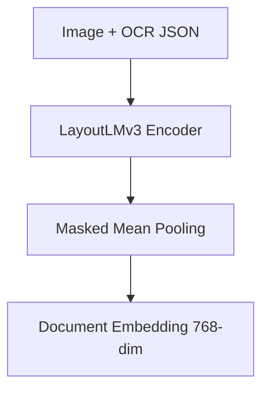
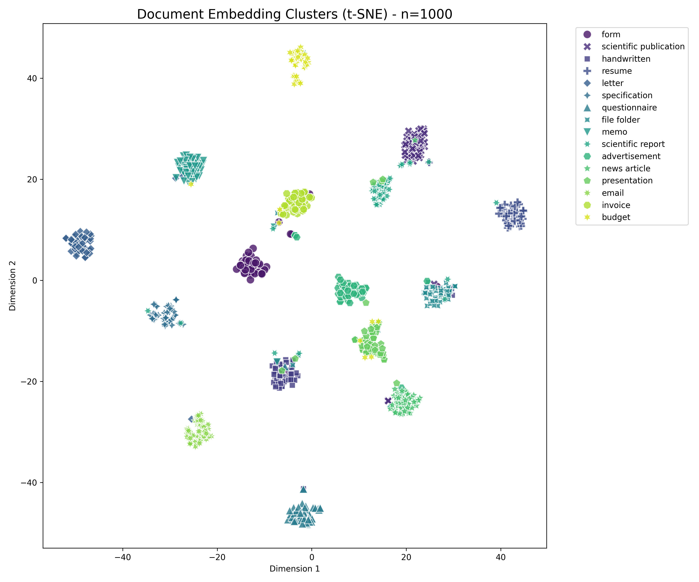

# 📂 Multimodal RAG Project

문서 이미지(Document Image)와 텍스트 정보를 함께 이해하여  
**Retrieval-Augmented Generation(RAG)** 시스템을 구축하는 멀티모달 프로젝트입니다.

본 프로젝트는  
**문서 이미지 수집 → 전처리 → 문서 이해 모델 → 검색 → 생성**으로 이어지는  
End-to-End 파이프라인 구축을 목표로 합니다.

단순 텍스트 검색을 넘어, **레이아웃(Layout)과 시각적 정보(Visual Features)**를 함께 활용하여 검색 정확도를 높이는 RAG 시스템을 지향합니다.

현재 Phase 2 (모델 학습 및 임베딩) 단계까지 완료되었습니다.

---

## Project Status

- [x] **Phase 1: 인프라 구축 및 데이터 파이프라인**
- [x] **Phase 2: 멀티모달 모델 학습 및 임베딩**
- [ ] **Phase 3: RAG 시스템 구현 및 컨테이너화**
- [ ] **Phase 4: 클라우드 배포 및 문서화**

---

## 📊 Dataset

HuggingFace의 `rvl_cdip` 데이터셋을 **Streaming 방식**으로 수집하여  
문서 이미지 분류 및 멀티모달 학습에 활용 가능한 Subset을 구축했습니다.

- **Total Images:** 1,000
- **Classes:** 16  
  (Scientific publication, Budget, Invoice, Resume 등)
- **Dataset Processing**
  - 클래스 균형을 고려한 Subset 구성
  - 깨진 이미지(Corrupt Image) 전수 검사 완료
  - 학습 및 서빙 공용 메타데이터 생성 (`data/metadata.json`)
- **Format:**
  - Raw: `.png`
  - Processed: `.json` (Metadata + Full Text + BBox Info)

### Dataset Distribution


### Dataset Samples


---

## Tech Stack

| Category | Technology |
| --- | --- |
| **Language** | Python 3.10+ |
| **OCR Engine** | PaddlePaddle, PaddleOCR |
| **Backend** | FastAPI, Uvicorn |
| **Data Processing** | Pydantic (Schema), Pillow, NumPy |
| **Model** | LayoutLMv3 (HuggingFace) |
| **Storage** | Parquet |
| **Visualization** | t-SNE (scikit-learn) |

---
## 💡 Key Methodologies
### Phase 1. OCR & Data Pipeline
- PaddleOCR 기반 문서 OCR 파이프라인 구축
- Text + Bounding Box 기반 JSON 스키마 설계
- FastAPI OCR 서비스 (POST /ocr)
- RAG 친화적 문서 단위 JSON 저장

---
### Phase 2. Multimodal Document Embedding
- 문서 분류를 넘어 RAG에서 사용할 문서 의미 임베딩(Document Embedding) 생성

#### 1. Multimodal Classification (Baseline)

- Model: `microsoft/layoutlmv3-base`
- Input:
  - Document Image
  - OCR Text
  - Layout (Bounding Boxes)
- Training:
  - Full Fine-tuning (Encoder Unfreeze)
- Result:
  - Validation Accuracy 85% 이상
- Purpose:
  - 문서 의미 학습 검증용 Baseline


---

#### 2. Document Embedding (Core)

- Classification Head 제거
- LayoutLMv3 Encoder 출력 직접 활용
- Masked Mean Pooling 기반 문서 임베딩 추출
- Embedding Dimension: 768



---

#### 3. Embedding Quality Check (t-SNE)

- Validation 데이터 전체 임베딩 추출 후 2D 차원 축소 (t-SNE)
- 결과: Random Distribution이 아닌, 클래스 단위의 명확한 의미적 군집 형성 확인
- 의의: 별도 Fine-tuning 없이 RAG Retriever 입력으로 사용 가능함 입증



---

### 4. Embedding Dataset

- RAG 연동을 위한 문서 임베딩 Parquet 저장
```text
document_embeddings.parquet
 ├── doc_id          (String) : 문서 고유 ID
 ├── file_path       (String) : 원본 파일 경로
 ├── label           (Int)    : 문서 클래스(0~15)
 ├── embedding       (List)   : 768-dim Vector (Float32)
 ├── ocr_text_full   (String) : 검색용 원문 텍스트
 └── metadata        (Dict)   : 기타 메타데이터
```
---

### 5. API & Engineering

- 실험 코드와 서버 코드 분리 및 모델 로딩 Singleton 패턴 적용
- Embedding API (POST /embeddings): 문서 이미지 입력 시 768차원 벡터 반환


## Next Step: Phase 3. RAG System & Deployment

문서 임베딩을 활용해 **검색(Retrieval) → 생성(Generation)** 이 연결된 End-to-End RAG 시스템을 구축하고, Docker 컨테이너로 패키징하여 배포합니다.

### 1. Vector Database & Retrieval
* **Vector DB 구축:** ChromaDB 또는 FAISS를 활용하여 문서 임베딩 데이터를 적재(Ingestion)합니다.
* **검색 로직 구현:** Query 텍스트를 벡터화한 뒤, Cosine Similarity 기반으로 가장 유사한 문서(Top-k)를 검색합니다.
* **API:** `POST /search` (사용자 질문 입력 → 관련 문서 Top-k 반환)

### 2. LLM-based Generation
* **Context Injection:** 검색된 문서 내용을 LLM(OpenAI 등)의 프롬프트에 주입하여 답변을 생성합니다.
* **Prompt Engineering:** Hallucination(거짓 답변)을 억제하고, 문서 내용에 기반한 정확한 답변을 유도합니다.
* **API:** `POST /chat` (Retrieval + Generation 과정이 통합된 QA 인터페이스)

### 3. Engineering & Deployment
* **Backend Refactoring:** 실험용 코드(Notebook 등)를 FastAPI 백엔드 아키텍처에 맞춰 모듈화 및 최적화합니다.
* **Containerization:** `Dockerfile`을 작성하여 로컬 및 클라우드 환경에서 동일하게 실행 가능한 컨테이너 이미지를 빌드합니다.
